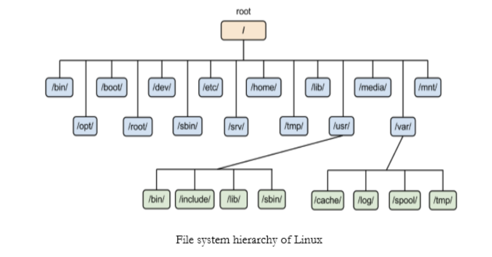

# 리눅스

## 1. 운영체제

**운영체제**란 사용자가 컴퓨터의 하드웨어를 쉽게 사용할 수 있도록 인터페이스를 제공하고 

각종 하드웨어적인 자원과 소프트웨어적인 자원을 효율적으로 운영, 관리함으로써 사용자가 

시스템을 이용하는데 편리함을 제공하는 **소프트웨어**이다.
  
대표적인 운영체제 : 윈도우, 맥, 리눅스 등
  
쉽게 생각하면 컴퓨터는 0과 1만 인식하기 때문에 사람의 말을 전달하기 위해 os를 통해 사람의 명령어를

 컴퓨터가 알 수 있도록 바꿔서 실행. 즉 컴퓨터랑 사람이랑 대화를 할 수 있게 다리 역할을 한다. 

> 커널과 쉘 
커널(kernel) - 운영체제의 핵심으로서 프로세스(process) 관리, 메모리 관리, I/O 시스템 관리, 파일 시스템 관리 등을 수행. 
쉘 (shell) - 사용자와 내부 커널 사이의 명령어를 해석해 줌  
사용자가 입력한 명령어는 일련의 과정을 거쳐 하드웨어를 제어하게 된다. 
사용자가 명령어를 입력하면 쉘이 이것을 받아들여 해석하여 커널을 통해 하드웨어를 조작한다.

  

## 2. 리눅스

- 오픈 소스(누구나 자유롭게 확인, 수정, 배포할 수 있는 코드)
- 네트워크 운영체제(멀티 태스킹, 멀티 스레드)

 

### 2.1 리눅스 기본 명령어

- pwd : 현재 작업중인 디렉토리

- ls(List Segments) : 현재 위치 파일 목록 출력

- cd(Change Directory) : 디렉토리(폴더) 이동

- mkdir(Make Directory) : 디렉토리(폴더) 생성

- touch : 파일 생성

- vi(파일명.확장자) : 파일 편집할 수 있는 에디터 활성화

- cp : 복사(cp 복사하고싶은대상 복사한대상이름)

- rm(remove) : 파일 삭제(주의 : rm -rf * why? 잘못하면 컴)

- mv : 파일 이동(mv 파일명 이동경로)

 

### 2.2 리눅스의 디렉토리 구조

- root : 최상위 경로, / 기호로 접근

- home : 사용자의 홈 디렉토리, ~ 기호로 바로 접근

- bin : Binary의 약자, OS 최소한의 구동을 위해 필요한 프로그램이 들어있는 폴더

 

### 2.3 상대경로와 절대경로

1. 절대 경로 : 최상위 디렉토리(root)부터 파일까지 이르는 경로

ex) /home/eun/bin

2. 상대경로 : 현재 위치한 디렉토리를 기준으로 하는 경로

ex ) ./ -> 현재의 디렉토리 / ../ -> 상위 디렉토리

