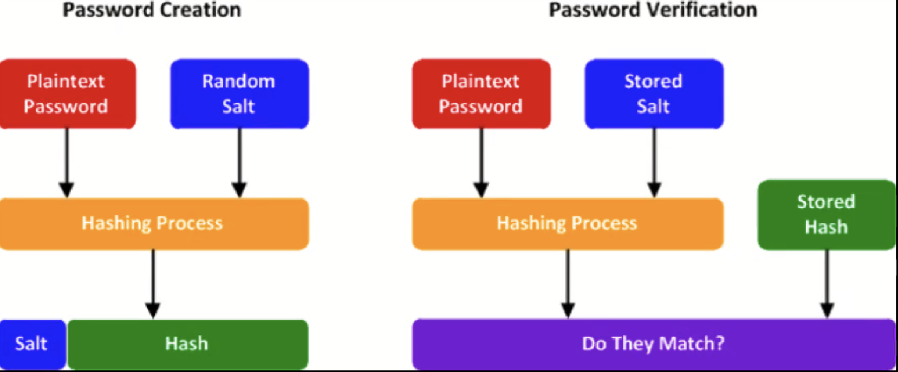
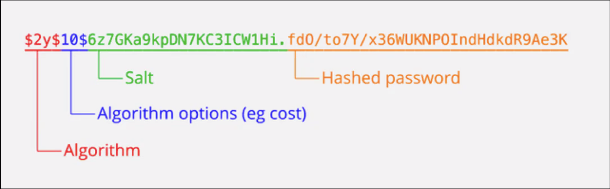
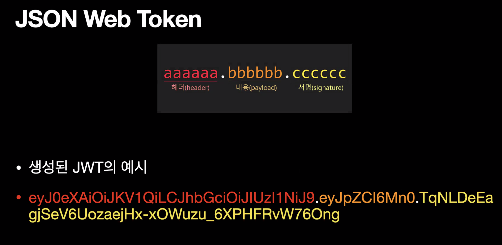

# 인증, 인가

## 인증(Authentication)
### 인증은 왜  필요한가?
1. 우리 서비스를 누가 쓰는지, 어떻게 사용하는지, 추적이 가능하도록
2. 인증에 필요한 것은 아이디, 이메일주소, 비밀번호 등 -> 가장 중요한 것은 비밀번호(개인 정보로써 다른 사람이 알 수 없도록 관리)
 

#### 비밀번호를 어떻게 관리해야하는가
1. 법규상의 강제 -  법으로 비밀번호, 바이오정보, 주민등록번호 등과 같은 주요 개인정보는 암호화되도록 조치를 취해야한다.
2. 데이터베이스에 저장 시 개인 정보를 해싱하여 복원할 수 없도록 함.
3. 통신 시 개인 정보를 주고받을 때 SSL을 적용하여 암호화(HTTPS)
 

### 암호화는 어떻게 하나?
1. 단방향 해쉬(one-way hash function)

- 단방향 해쉬함수는 암호학적 용도로 사용
- 원본 메시지를 변환하여 암호화된 메시지인 다이제스트(digest)를 생성한다. 원본 메시지를 알면 암호화된 메시지를 구하기는 쉽지만 암호화된 메시지를 구할 수 없어서 단방향성이라고 한다.
- MD5, SHA-1, SHA-256 등이 있음
- 예시 ) '1234'를  SHA-256 해싱하면 다음과 같다 '03AC674216F3E15C761EE1A5E255F067953623C8B388B4459E13F978D7C846F4'
- 같은 알고리즘으로 '1234' 를 다시 해싱하면 항상 같은 결과가 도출

 

2. 이 같은 허점을 보완하고자 **Salting**과 **Key Stretching**을 사용한다.

> Salting - 실제 비밀번호 이외에 추가적으로 랜덤 데이터를 더해서 해시값을 계산하는 방법

> Key Stretching - 단방향 해쉬값을 계산 한 후 그 해쉬값을 또 해쉬하고, 또 이를 반복하는 것
 

- 단순 해쉬값이 해킹에 노출되기 때문에 Salting이라는 아이디어가 생겨남
- 입력한 비밀번호와 임의로 생성한 문자열(Salt)를 합쳐서 해싱해서 이 해시값을 저장하는 방법
- 이때에 비교를 위해 해시값과 소금(Salt)값을 같이 저장해야 한다.
- 해커가 패스워드 무작위 대입을 통해 해시값을 계산하는데 필요한 시간을 대폭 늘리기 위해 Salting 및 해싱을 여러번 반복해서 원본 값을 유추하기 어렵게 만드는 것이 키 스트랫칭(Key Strctching)
- 단순히 해킹하는데 걸리는 시간을 늘리는 방법임

3. **bcrypt**

- Salting & Key Stretching 대표적 라이브러리
- bcrypt는 앞서 말한 개념들을 실제로 적용하기 편하게 해주는 대표적 라이브러리
- 다양한 언어를 지원하고 있으며, 사용이 간편하여 쉽게 적용이 가능
- bcrypt는 hash 결과값에 소금값과 해시값 및 반복횟수를 같이 보관하기 때문에 비밀번호 해싱을 적용하는데 있어 DB설계를 복잡하게 할 필요가 없다
- bcrypt를 통해 해싱된 결과 값(Digest)는 다음과 같다

  
## 인가(Authorization)

### 인가 Authorization

- 해당 유저가 request에 해당하는 권한이 있는지 확인하는 절차
- HTTP의 특징 - request/response 요청과 응답 , stateless한 성질(저장하지 않는 성질)
- 서버는 사용자가 로그인 했을 경우, 로그인 했다는 것을 어떻게 알 수 있나?
 

headers에 메타데이터를 보내서 확인
이 메타정보를 JSON Web Token 일명 'JWT'라고 한다
토큰이 없다면 매번 로그인 정보를 확인해야하지만 토큰이 있다면 로그인이 필요한 모든 액션을 처리할 수 있다.
 

### JSON Web Token

#### 헤더(header)

- 헤더에는 토큰의 타입과 해시알고리즘 정보가 들어간다.
- 헤더의 내용은 BASE64 방식으로 인코딩해서 JWT의 가장 첫 부분에 기록
- 예시 - {"alg":"HS256", "typ": '...'}
 

#### 내용(playlod)

- 만료시간을 나타내는 exp와 같이 미리 정의된 집합인 Registered Claim
- 공개된 정보 전달을 목적으로 하는 Public Claim
- 클라이언트와 서버간 협의하에 사용하는 Private Claim
- 위의 세 가지 요소를 조합하여 작성한뒤 BASE64 인코딩하여 두번째 요소로 위치한다.
- 예시 = {"user-id" : 1, "exp" : 1539517391}
 

#### 서명(signature)

- JWT가 원본 그대로라는 것을 확인할 때 사용하는 부분
- 시그니처는 BASE64URL 인코드된 header 와 payload 그리고 JWT secret(별도 생성)을 헤더에 지정된 암호 알고리즘으로 암호화하여 전송한다(복호화 기능)
- 프론트엔드가 JWT를 백엔드 API 서버로 전송하면 서버에서는 전송받은 JWT의 서명부분을 복호화하여 서버에서 생성한 JWT가 맞는지 확인한다.
- 계약서의 위변조를 막기위해 서로 사인하는 것과 같다고 보면된다.
- 주의할 점은 header와 payload는 BASE64 인코딩한 것이므로(암호화아님) 누구나 원본을 볼 수 있으니 개인정보를 담아서는 안된다

