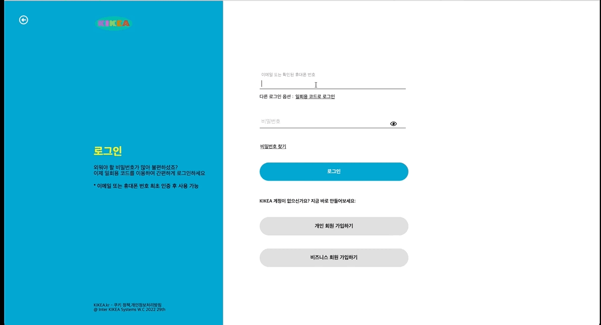
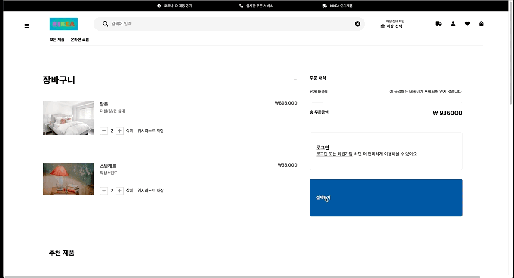

## 1. 소개

2주 동안 팀 프로젝트로 이케아 페이지를 클론 코딩
프론트엔드와 백엔드를 나눠서 진행했으며 프론트엔드 분야를 맡았다.

이케아 - 인테리어 가구, 소품을 판매하는 사이트

카테고리,신제품, 가격 등에 따라 필터링이 가능하다

  

## 2. Tech Skills

 

 

 

  

## 3. 구현 부분

메인 페이지

#### - 자바스크립트로 구현한 이미지 캐러셀(추천 제품)

#### - 상품 품목에 따른 필터링 구현

 

로그인 페이지

#### - 데이터 통신을 통한 에러 핸들링

#### - 로그인 여부에 따라 토큰 저장

 

회원가입 페이지

#### - 아이디, 비밀번호 정규식 표현을 통한 유효성 검사

#### - 데이터 통신을 통한 데이터 존재 유무 판별

 

결제 페이지

#### - 유저의 보유 포인트롤 통한 결제 기능 구현

 

사이드바 데이터 통신으로 카테고리 구현

  

## 4. 전체 시연 연상

#### [전체시연영상](https://www.youtube.com/watch?v=2w99doEHCzE)

  

## 5. 프로젝트 후기

#### 좋았던 점

처음으로 한 팀 프로젝트라 기대를 많이 했다. 모르는 부분을 서로 가르쳐주면서 많은 도움이 됨

작년에는 일을 할 때 거의 혼자서 프론트,백엔드작업을 해 팀으로 하는 것이 익숙치 않고 혼자하는 것이 편했는데

백엔드와의 통신, 다른 팀원들간의 협업 등 혼자가 아닌 팀으로 한다는 느낌을 받았음

 

#### 아쉬웠던 점

팀원들 간의 소통 부족

팀 작업이지만 공통 컴포넌트를 나누지 않고 각자 똑같은 컴포넌트를 개발(중복된 코드 작성)

팀 프로젝트라고는 하지만 짧은 시간안에 개발을 해야한다는 생각 때문에 팀원들과 코드를 잘 보지 못했고 피어리뷰

진행을 거의 못했다
